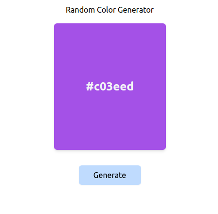

# Random Color Genrator



The default template project for [nano-react-app](https://github.com/nano-react-app/nano-react-app).

- `npm start` — This will spawn a development server with a default port of `3000`.
- `npm run build` — This will output a production build in the `dist` directory.

## Custom port

You can use the `-p` flag to specify a port for development. To do this, you can either run `npm start` with an additional flag:

```
npm start -- --port 1234
```

Or edit the `start` script directly:

```
vite --port 1234
```

# How it works
- Math.floor(Math.random()*16777215).toString(16) used to generate the random number 
- State and background is set after generating the number

